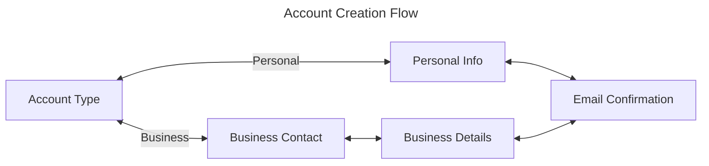
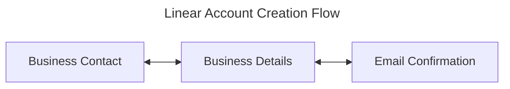
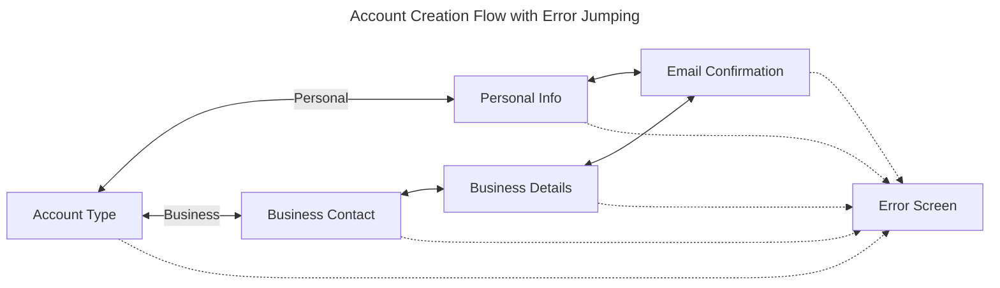
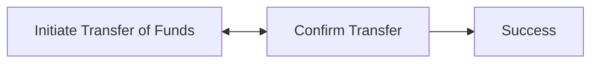
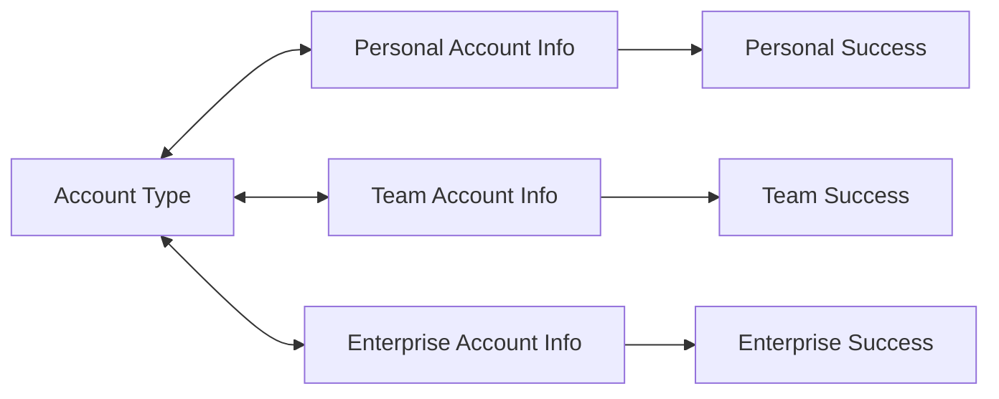

# Creating Screen Flows with Finite State Machines

> Just go with the flow.

## Introduction

When building out the frontend for
[Infinite Giving's investment platform](https://infinitegiving.com), a common
pattern I was faced with was building out series of screens where users would
fill out their information on each screen - a multi-part submission process.
This pattern was fairly ubiquitous at Infinite Giving given the amount of
financial information users had to provide while onboarding. Users would fill
out a series of questions on screen, and based on their answers, they would be
brought to a different screen.

With our first onboarding implementation, users could navigate through a flow
that had nearly 20 possible different screens, with various
branching/convergence points and screens being frequently added/removed based on
requirements. As such, implementing screen navigation in a scalable, easy to
read way was a priority.

## What is a Flow?

Let's refer to this pattern as a **flow,** _a series of connected screens, where
the screen ordering presented to the user may change based on user input_.
Consider a simple example of a flow where a user creates an account, which
involves submitting information across different screens on a single route,
`/new-account`:

- On the first screen, they're asked if the account is for personal or business
  use.

  - If the user selects "personal", the next screen asks for their personal
    info.

  - If the user selects "business", the next screen asks for their business
    contact info. After this, they're brought to another screen asking for
    business details.

- After the user has filled out the necessary information, they're brought to an
  email confirmation screen, marking the end of this onboarding flow.



Also assume that on each screen, the user has the ability to go **back** to the
previous screen or **next** to the following screen when applicable. How can we
concisely define this flow's behavior in code?

## Finite State Machines

As it turns out, our flow can be represented as a
[**finite state machine (FSM)**](https://en.wikipedia.org/wiki/Finite-state_machine).
Like an FSM, the flow must exist in exactly one of a finite universe of states
at any given time, and can transition between these states based on an input. In
our case, **the states are the screens**. There's only two inputs for each
screen, `next` and `previous` - our FSM's transition function will take the
current state, and the input, to determine the next state. Of course, we also
have the additional caveat that our flows must consider external context, such
as the user provided input and selections. Nonetheless, reasoning about our flow
as an FSM is a helpful way to begin an implementation.

At this point, I had the option to either use an FSM library like
[`xstate`](https://xstate.js.org/) or implement a solution myself. Given the
lightweight nature of my usecase, I decided to go for the latter.

## Implementation

For my implementation, I won't go into the details of any UI or specific web
framework. We're only going to focus on the implementation of the FSM itself -
I'll leave it as an excerise to the reader to integrate this with their own UI
framework (using a reducer for React, etc.).

### Purely Linear Flows

To make things easier, let's envision a simpler version of our example flow that
doesn't have any branching:



Let's define some initial states, an object of strings that represent each
screen. We'll also need an `Input` type to represent our possible inputs (just
`next` and `previous`).

```typescript
const States = {
  BusinessContact: "BusinessContact",
  BusinessDetails: "BusinessDetails",
  EmailConfirmation: "EmailConfirmation",
} as const;

type State = keyof typeof States;

const Inputs = {
  next: "next",
  previous: "previous",
} as const;

type Input = keyof typeof Inputs;
```

`State` now represents the universe of states for our flow. Now, let's define a
machine, which declaratively defines the transitions between states. Let our
machine be an object, where each key is a state, and each value is an object
with `next` and `previous` defined as strings.

```typescript
type Machine = Record<State, { next: State | null; previous: State | null }>;

const machine: Machine = {
  [States.BusinessContact]: {
    next: States.BusinessDetails,
    previous: null,
  },
  [States.BusinessDetails]: {
    next: States.EmailConfirmation,
    previous: States.BusinessContact,
  },
  [States.EmailConfirmation]: {
    next: null,
    previous: States.BusinessDetails,
  },
};
```

Great! This machine helps describe our transition function - it's essentially a
transition matix. Note that we allow `null` as a defined state in our machine.
We're going to use `null` to denote an invalid state (ex: there's no way to go
to a screen before the business contact screen, because it's the start of the
flow). The FSM itself cannot exist in the `null` state.

Let's create an `FSM` class that takes in the machine and the starting state,
and provides a method to transition to the next/previous state. We're going to
define a `peek` method that takes in an input and returns the next state, and a
`transition` method which will call the `peek` method to determine the next
state and actually mutate the FSM's current state.

```typescript
class FSM {
  machine: Machine;
  currentState: State;

  constructor(machine: Machine, initialState: State) {
    this.currentState = initialState;
    this.machine = machine;
  }

  peek(input: Input): State | null {
    if (this.currentState == null) return null;
    return this.machine[this.currentState][input];
  }

  transition(input: Input) {
    const transitionState = this.peek(input);
    if (transitionState == null) {
      throw new Error("Invalid transition for state");
    }
    this.currentState = transitionState;
    return transitionState;
  }

  getCurrentState() {
    return this.currentState;
  }

  peekNext() {
    return this.peek(Inputs.next);
  }

  peekPrevious() {
    return this.peek(Inputs.previous);
  }

  next() {
    return this.transition(Inputs.next);
  }

  previous() {
    return this.transition(Inputs.previous);
  }
}
```

Note that our `peekNext`, `peekPrevious`, `next`, and `previous` methods are
just abstractions that call `peek` and `transition` with the appropriate input.
Also, note that we throw an error if we attempt to transition to an invalid
state (`null`). This is an implementation detail - another approach may be to
simply return the `currentState`, creating a state loop when an invalid
transition is attempted.

### Simple FSM in Action

Let's spin up an FSM instance and see how we can use it. With our machine
defined already, all we need to do is decide an initial state:

```typescript
let currentState: State = States.BusinessContact;
const fsm = new FSM(machine, currentState);

currentState = fsm.next(); // BusinessDetails
currentState = fsm.next(); // EmailConfirmation
currentState = fsm.previous(); // BusinessDetails
```

Our API also gives us the flexibility of checking what transitioned state will
be without actually having to transition. For example, if we `peekNext` and find
that it's `null`, it means we've reach the "end" of our flow and can exit the
user:

```typescript
let nextState = fsm.peekNext();
if (nextState == null) {
  // exit flow, maybe navigate to a different route or show a confirmation modal
}
```

### Adding Branching

Our simple FSM works exactly how we want for pure linear flows, but the
challenge we set out to solve was to handle branching flows based on external
context. Recall the original flow:


Since the branching is based on user input, this means dynamically evaluating
`next` and `previous` in our machine rather than simply declaring a string. We
can do this by also allowing `next` and `previous` to be functions that return a
state. These functions are evaluated at the time of transition.

To start, let's update our states to include the new screens:

```typescript
const States = {
  AccountType: "AccountType",
  PersonalInfo: "PersonalInfo",
  BusinessContact: "BusinessContact",
  BusinessDetails: "BusinessDetails",
  EmailConfirmation: "EmailConfirmation",
} as const;
```

Now, our machine needs to accept both declared states and functions that return
states. We need to define functions that handle branching at two states:

1. `AccountType` - if the user selects personal, the next state is
   `PersonalInfo` and if the user selects business, the next state is
   `BusinessContact`.
2. `Email Confirmation` - the previous state is `BusinessDetails` if the user
   selected business, and `PersonalInfo` if the user selected personal.

```typescript
type AccountType = "personal" | "business";
let accountType: AccountType = "personal";

type EvaluatedState = State | (() => State) | null;
type Machine = Record<
  State,
  { next: EvaluatedState; previous: EvaluatedState }
>;

const machine: Machine = {
  [States.AccountType]: {
    next: () =>
      accountType === "personal" ? States.PersonalInfo : States.BusinessContact,
    previous: null,
  },
  [States.PersonalInfo]: {
    next: States.EmailConfirmation,
    previous: States.AccountType,
  },
  [States.BusinessContact]: {
    next: States.BusinessDetails,
    previous: States.AccountType,
  },
  [States.BusinessDetails]: {
    next: States.EmailConfirmation,
    previous: States.BusinessContact,
  },
  [States.EmailConfirmation]: {
    next: null,
    previous: () =>
      accountType === "personal" ? States.PersonalInfo : States.BusinessDetails,
  },
};
```

Importantly, notice that the additional context (the `accountType`) is defined
outside the machine. This is intentional - our FSM is only concerned with
handling next/previous inputs. The only state our FSM needs to know about is the
state it's currently in - the FSM itself is effectively stateless. Another
benefit of this design is that it offers more flexibility to the developer for
how user provided data is managed. For example, the user data could be stored in
an external service, so we'd have to make our `next` function async and fetch
results. Again, this is an implementation detail, you can write your FSM to have
its own internal context.

Something else you may have noticed is that it may feel redundant to have to
define a `next` function where the flow diverges, and a `previous` function that
performs the exact opposite where the flow converges. While this may be true, an
important consideration about flows is that **the way forward is not always the
way back**. If this were always the case, we wouldn't need to define a
`previous` field at all - we could maintain a stack of visited states and pop
from the stack whenever going backwards. In a more complex flow, the user could
have provided other information in subsequent screens that change the degree of
branching or where the back button should lead to.

There's only one thing left to do - update our `peek` method in the FSM class.
We need to check if the next/previous state is a function, and if so, call it to
get the evaluated state.

```typescript
class FSM {
  machine: Machine;
  currentState: State;

  ...

  peek(input: Input): State | null {
    if (this.currentState == null) return null;
    const evaluatedState = this.machine[this.currentState][input];
    if (typeof evaluatedState === "function") {
      return evaluatedState();
    }
    return evaluatedState;
  }

  ...
}
```

That's it! Our FSM is now capable of handling branching flows based on external
context. Let's try it out:

```typescript
let accountType: AccountType = "personal";
let currentState: State = States.AccountType;

const fsm = new FSM(machine, currentState);
accountType = "business"; // user selects business
currentState = fsm.next(); // BusinessContact
currentState = fsm.previous(); // user goes back to AccountType
accountType = "personal"; // user changes selection to personal
currentState = fsm.next(); // PersonalInfo
```

The above snippet simulates how a user may have accidentally selected "business"
on the Account Type screen, went back, changed the account type to "personal",
and then proceeded to the Business Contact screen.

In the next section, we'll add some additional functionality that will make our
FSM more useful in a real-world application.

## Extra Features

### Transition Events

In a real application, we may want to perform some side-effects when the user
transitions between screens. For example, we may want to cleanup some context if
the user leaves a screen where they entered sensitive data, or we may want to
register an analytics event if they reach a screen at the end of the flow. We
can add this functionality to our FSM by allowing the user to register optional
callbacks for when a state is entered and left. Let's refer to these callbacks
as `onEnter` and `onExit`.

```typescript
type Machine = Record<
  State,
  {
    next: EvaluatedState;
    previous: EvaluatedState;
    onEnter?: () => void;
    onExit?: () => void;
  }
>;
```

In our `transition` function, we conditionally call the `onExit` callback of the
current state, perform the transition, and conditionally call the `onEnter`
callback of the resulting state.

```typescript
class FSM {
  machine: Machine;
  currentState: State;

  ...

  transition(input: Input) {
    const transitionState = this.peek(input);
    if (transitionState == null) {
      throw new Error("Invalid transition for state");
    }
    this.machine[this.currentState].onExit?.(); // call onExit of current state
    this.currentState = transitionState;
    this.machine[this.currentState].onEnter?.(); // call onEnter of new state
    return transitionState;
  }

  ...
}
```

Let's add some `onEnter` and `onExit` callbacks to our machine. We'll add an
`onEnter` callback to the `EmailConfirmation` state that logs a message to the
console, and an `onExit` callback to the `BusinessDetails` state saves some data
to `localStorage`.

```typescript
const machine: Machine = {
  [States.AccountType]: {
    next: () =>
      accountType === "personal" ? States.PersonalInfo : States.BusinessContact,
    previous: null,
  },
  [States.PersonalInfo]: {
    next: States.EmailConfirmation,
    previous: States.AccountType,
  },
  [States.BusinessContact]: {
    next: States.BusinessDetails,
    previous: States.AccountType,
  },
  [States.BusinessDetails]: {
    next: States.EmailConfirmation,
    previous: States.BusinessContact,
    onExit: () => localStorage.setItem("businessDetails", "some data"),
  },
  [States.EmailConfirmation]: {
    next: null,
    previous: () =>
      accountType === "personal" ? States.PersonalInfo : States.BusinessDetails,
    onEnter: () => console.log("User completed onboarding"),
  },
};
```

That's it! Our FSM now has the ability to perform side effects when
transitioning between states. You can also extend this concept by adding global
`onLeave` and `onEnter` callbacks to the FSM class itself which are invoked on
any transition.

### Jumping

Right now, our flow only allows us to go to the next/previous state from the
current state. In an ideal world, your flow should follow the strict rule where
a screen can only reach other screens via the next/previous inputs - we have
enough flexibility with the fact that `next` and `previous` can be dynamically
evaluated to make this rule possible.

What if you have a use-case that that requires _jumping_ between two
non-adjacent states?. Suppose, for example, we have some fallback error screen
that we want to jump to from any other state in the case of an exception (again,
this can be written into the `next` and `previous` functions of your states).



We can make this possible by adding a `jump` method that takes in a state and
transitions to it directly, invoking the `onExit` and `onEnter` callbacks as
well.

```typescript
class FSM {
  machine: Machine;
  currentState: State;

  ...

  jump(state: State) {
    this.machine[this.currentState].onExit?.();
    this.currentState = state;
    this.machine[this.currentState].onEnter?.();
    return state;
  }

  transition(input: Input) {
    const transitionState = this.peek(input);
    if (transitionState == null) {
      throw new Error("Invalid transition for state");
    }
    return this.jump(transitionState);
  }

  ...
}
```

Note that we also use this `jump` method in our `transition` method to perform
the actual state mutation. Now, we can jump to the error screen from any state:

```typescript
let accountType: AccountType = "personal";
let currentState: State = States.AccountType;

const fsm = new FSM(machine, currentState);
fsm.jump(States.ErrorScreen);
```

## Generalized Implementation

Right now, the states are hardcoded into our FSM class. Let's make things more
flexible by allowing the user to define their own states when creating an FSM
instance.

```typescript filename="generic-fsm.ts"
type EvaluatedState<T> = () => T;
type States<T> = T | EvaluatedState<T> | null;
type Machine<T extends string> = Record<
  T,
  {
    next: States<T>;
    previous: States<T>;
    onEnter?: () => void;
    onExit?: () => void;
  }
>;

class FSM<T extends string> {
  currentState: T;
  machine: Machine<T>;

  constructor(machine: Machine<T>, initialState: T) {
    this.currentState = initialState;
    this.machine = machine;
  }

  peek(input: Input): T | null {
    if (this.currentState == null) return null;
    const evaluatedState = this.machine[this.currentState][input];
    if (evaluatedState instanceof Function) {
      return evaluatedState();
    }
    return evaluatedState;
  }

  jump(state: T) {
    if (this.currentState == state) return state;
    this.machine[this.currentState].onExit?.();
    this.currentState = state;
    this.machine[this.currentState].onEnter?.();
    return state;
  }


  ...
}
```

One could also create a more generic FSM that accepts user defined `Inputs`,
rather than just `next` and `previous`, if you had a more advanced use case.

## Putting it all Together

Below is a full example using the generic FSM class we've defined above, along
the original flow example. We first define the FSM abstraction and associated
types:

```typescript filename="FSM.ts"
const Inputs = {
  next: "next",
  previous: "previous",
} as const;

type Input = keyof typeof Inputs;

type EvaluatedState<T> = () => T;
type States<T> = T | EvaluatedState<T> | null;
export type Machine<T extends string> = Record<
  T,
  {
    next: States<T>;
    previous: States<T>;
    onEnter?: () => void;
    onExit?: () => void;
  }
>;

export class FSM<T extends string> {
  currentState: T;
  machine: Machine<T>;

  constructor(machine: Machine<T>, initialState: T) {
    this.currentState = initialState;
    this.machine = machine;
  }

  peek(input: Input): T | null {
    if (this.currentState == null) return null;
    const evaluatedState = this.machine[this.currentState][input];
    if (evaluatedState instanceof Function) {
      return evaluatedState();
    }
    return evaluatedState;
  }

  jump(state: T) {
    this.machine[this.currentState].onExit?.();
    this.currentState = state;
    this.machine[this.currentState].onEnter?.();
    return state;
  }

  transition(input: Input) {
    const transitionState = this.peek(input);
    if (transitionState == null) {
      throw new Error("Invalid transition for state");
    }
    return this.jump(transitionState);
  }

  getCurrentState() {
    return this.currentState;
  }

  peekNext() {
    return this.peek(Inputs.next);
  }

  peekPrevious() {
    return this.peek(Inputs.previous);
  }

  next() {
    return this.transition(Inputs.next);
  }

  previous() {
    return this.transition(Inputs.previous);
  }
}
```

And in the file below, we use the FSM class to define a machine for the original
flow and use it to transition between states:

```typescript filename="example.ts"
import { FSM } from "./FSM";
import type { Machine } from "./FSM";

const States = {
  AccountType: "AccountType",
  PersonalInfo: "PersonalInfo",
  BusinessContact: "BusinessContact",
  BusinessDetails: "BusinessDetails",
  EmailConfirmation: "EmailConfirmation",
} as const;

type State = keyof typeof States;

let accountType = "personal";

const machine: Machine<State> = {
  AccountType: {
    next: () =>
      accountType === "personal" ? "PersonalInfo" : "BusinessContact",
    previous: null,
  },
  PersonalInfo: {
    next: "EmailConfirmation",
    previous: "AccountType",
  },
  BusinessContact: {
    next: "BusinessDetails",
    previous: "AccountType",
  },
  BusinessDetails: {
    next: "EmailConfirmation",
    previous: "BusinessContact",
    onExit: () => localStorage.setItem("businessDetails", "some data"),
  },
  EmailConfirmation: {
    next: null,
    previous: () =>
      accountType === "personal" ? "PersonalInfo" : "BusinessDetails",
    onEnter: () => console.log("User completed onboarding"),
  },
};

let currentState: State = States.AccountType;
const fsm = new FSM<State>(machine, currentState);
accountType = "business";
currentState = fsm.next(); // BusinessContact
currentState = fsm.previous(); // AccountType
accountType = "personal";
currentState = fsm.next(); // BusinessContact
```

## Usage Patterns

There's some neat patterns we can adopt by using an FSM for our flow management:

### 1. Showing & Hiding UI

Suppose your flow UI has a Next button and a Back button that are rendered or
disabled based on whether the action is possible or not. We can check whether
`fsm.peekNext()` or `fsm.peekPrevious()` is `null` to determine if the current
stage has a next/previous neighbor, allowing us to show/hide the buttons
respectively.

### 2. Checkpoint Screens

In all our previous examples, the flow diagrams were bi-directional, in that you
could always go back the way you came. This may not be true for all screens in
your flow.

A simple (and common) example is a success screen - suppose your flow ends with
a success screen. At this point, the user has completed all data submission, so
you don't want them to go backwards and resubmit. However, there is no other
screen to advance to either.

Another (less common) example is a screen in the middle of a flow where the user
enters some immutable information that they should not be able to backtrack and
edit. The most complex example is a flow that changes the path backwards based
on user input in the leading stages.

I refer to all of these cases as **"checkpoint screens"** - stages of the flow
where once the user enters, they cannot go back. Below is a simple diagram of a
flow with a success screen (note the arrow heads):



Our FSM gracefully handles this use case by allowing us to define a `null` value
for a state's neighbors in the machine. For more advanced case, the passage of a
function to evaluate next/previous states allows for complex logic based on
additional context. Here is the machine for the simple success screen above:

```typescript filename="create-transfer.ts"
const machine: Machine<State> = {
  InitiateTransfer: {
    next: "ConfirmTransfer",
  },
  ConfirmTransfer: {
    previous: "InitiateTransfer",
    next: "Success",
  },
  // Can't go next/back from success screen
  Success: {
    next: null,
    previous: null,
  },
};
```

### 3. Detecting Flow Ends

Suppose we have a flow that ends with various possible end success states, and
we want to know when the user has reached the end:



A brute-force solution is to check if `fsm.getCurrentState()` is one of the
known end states. However, our FSM provides a more elegant solution - if a
screen does not have a `next` state, it must be the end of the flow. Therefore,
we can check if `fsm.peekNext()` is `null` to determine if we've reached the
end. This approach scales to any number of branches without needing to specify
all end states explicitly.

## Conclusion

Screen management (especially in platforms with multi-part submissions) can
quickly scale out of hand, fast. Implementing FSMs to manage screen transitions
brings all the transition complexity into a single data structure with very
lightweight abstractions. Being able to declaratively define flow behavior in a
single place makes understanding branching possibilities and debugging/testing
significantly easier.

Testing transition logic fragmented across multiple components would be
cumbersome for testing - we now have a single object that can be evaluated
against using simple unit tests. Moreover, the ability to define side-effect
callbacks for each state makes the FSM easily integratable with external
data/services.

Lastly, the FSM we described is a flexible enough abstraction to describe
basically any flow diagram of screens. We can define complex branching,
convergences, loops, etc - anything that can be represented as a directed graph
is possible.

This was not the pattern I first used at Infinite Giving for our screen
management - I gradually iterated my way to FSMs as the complexity of our flows
grew. If multi-part user input flows are a common pattern in your application,
maybe you'll find this pattern useful too.
